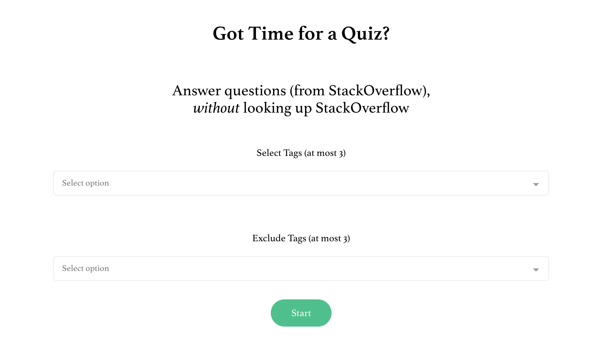
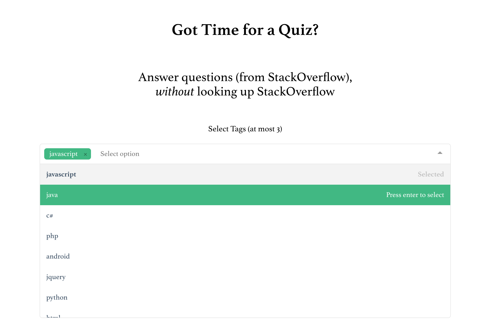
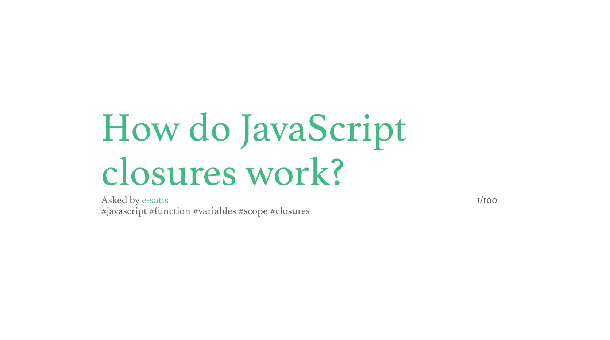

# stackoverflow-quiz

> Quiz yourslef with questions from StackOverflow!

Choose tags to use and tags to exclude and start a quiz.

Think about it yourself first and the answers are always just one click away.







## Build Setup

``` bash
# install dependencies
npm install

# serve with hot reload at localhost:8080
npm run dev

# build for production with minification
npm run build

# build for production and view the bundle analyzer report
npm run build --report

# run unit tests
npm run unit

# run all tests
npm test
```
